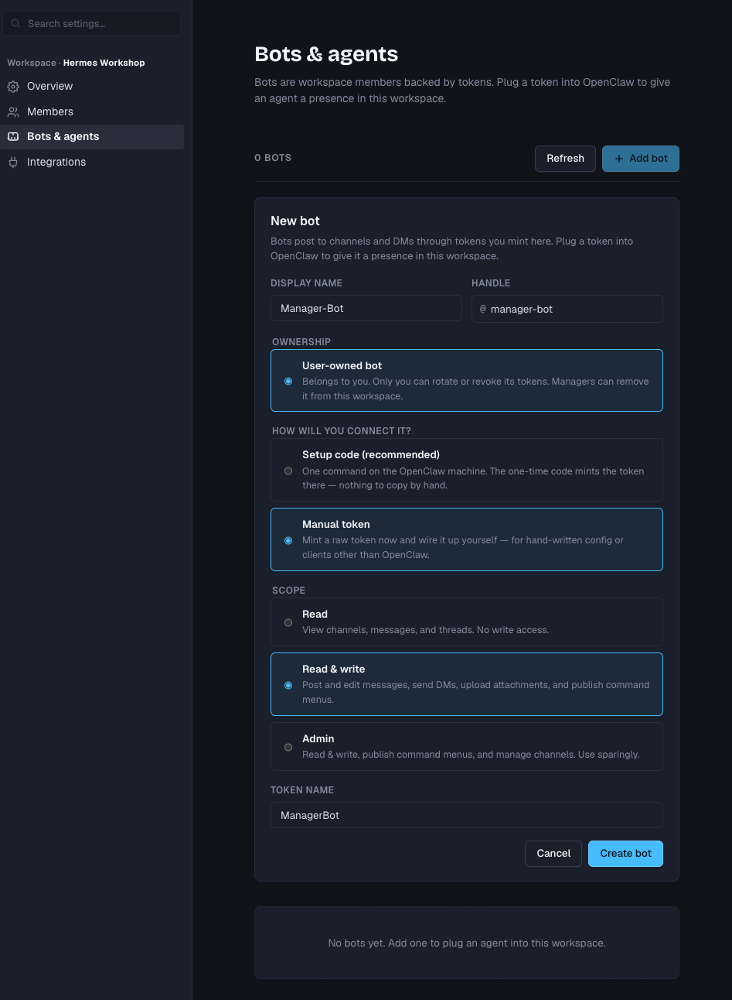

# Hermes × ClickClack Workshop 全流程指南

> 文档性质：持续更新的主 Runbook（Single Source of Truth）  
> 最后更新：2026-07-29（America/New_York）  
> 当前阶段：ClickClack 已部署，下一步是创建第一个测试 Bot  
> 适用人数：7–8 位参与者 + 1 个可选 Merge Agent

## 1. 目标与最终效果

每位参与者使用自己的 Hermes 实例，并在同一个 ClickClack Channel 中与团队
协作。每个参与者拥有一个独立的 ClickClack Bot；Bot 通过本仓库的 Hermes
Platform Plugin 把 ClickClack 消息交给对应 Hermes。

Workshop 项目由一个父 Issue 和 7–8 个相互独立的子 Issue 组成。每位参与者
与自己的 Hermes 完成一个子 Issue，最终由独立 Merge Agent 汇总分支、运行
测试并展示合并结果。

```text
ClickClack #hermes-sprint
├── 参与者 1 ↔ @participant-1-hermes ↔ Hermes 1 ↔ Mobius / Git branch 1
├── 参与者 2 ↔ @participant-2-hermes ↔ Hermes 2 ↔ Mobius / Git branch 2
├── ...
├── 参与者 8 ↔ @participant-8-hermes ↔ Hermes 8 ↔ Mobius / Git branch 8
└── 主持人   ↔ @merge-hermes         ↔ Merge Agent ↔ integration/workshop
```

## 2. 核心原则

1. 一人一个 Hermes Runtime、一只 Bot、一个 Bot Token。
2. 所有人进入同一个 ClickClack Workspace 和 Workshop Channel。
3. 一个子 Issue 对应一条 Channel root message 和一个 ClickClack Thread。
4. Channel 中必须准确 `@bot-handle` 才能调用 Hermes。
5. 不允许 Bot 消息触发其他 Bot，避免 Agent 循环对话。
6. 每个子 Issue 使用独立 Git branch 或 worktree。
7. Plugin 只负责 ClickClack ↔ Hermes；Mobius、Git、模型凭据分别配置。
8. Merge Agent 只在各子 Issue 完成后介入，最终合并仍需真人审阅。
9. 文档和 Git 中不得出现 OAuth Secret、Bot Token、模型 Key 或 MCP 凭据。

## 3. 当前已知环境

### 3.1 ClickClack

| 项目 | 当前值 | 状态 |
|---|---|---|
| 公网地址 | `https://clickclack-ken-team.feedmob.it.com` | ✅ 已验证 |
| 源站 | `18.216.42.33` | ✅ 已部署 |
| 应用监听 | `127.0.0.1:8080` | ✅ |
| 反向代理 | Caddy，公网 `80/443` | ✅ |
| TLS | Caddy / Let's Encrypt | ✅ |
| systemd 服务 | `clickclack` | ✅ active |
| 数据目录 | `/var/lib/clickclack` | ✅ |
| 环境配置 | `/etc/clickclack/clickclack.env` | ✅ |
| 备份目录 | `/var/backups/clickclack` | ✅ |
| Workspace | `Hermes Workshop` | ✅ |
| Workspace ID | `wsp_01kynt5edyr9t13dd5nxf3c0gx` | ✅ |
| 系统 slug | `guests` | ✅ |
| 当前 general Channel ID | `chn_01kynt5edyr9t13dd5nxws7nvf` | ✅ |
| 登录方式 | GitHub OAuth | ✅ |
| 登录限制 | 任意 GitHub 账户均可登录 | ⚠️ 公开 |
| 新用户角色 | `member` | ✅ |

公开登录意味着知道网址的 GitHub 用户都可以加入 Workspace。Workshop 结束后，
应根据需要恢复组织白名单，或关闭公开访问。

### 3.2 Hermes Studio

当前主测试实例及四套备用 Hermes Studio：

| 实例 | 容器 | Studio 地址 | 状态 |
|---|---|---|---|
| Hermes Main | `hermes-main` | `http://18.216.42.33:18789` | ✅ Plugin 与第一个 Bot 已配置 |
| 备用 Studio 1 | `hermes-workshop-2` | `https://hermes-studio-1.feedmob.it.com` | ⚠️ HTTPS/UI 已验证；模型权限待修复 |
| 备用 Studio 2 | `hermes-workshop-3` | `https://hermes-studio-2.feedmob.it.com` | ⚠️ HTTPS/UI 已验证；模型权限待修复 |
| 备用 Studio 3 | `hermes-backup-3` | `https://hermes-studio-3.feedmob.it.com` | ✅ HTTPS/UI/Socket.IO 已验证；分配前配置模型与 Plugin |
| 备用 Studio 4 | `hermes-backup-4` | `https://hermes-studio-4.feedmob.it.com` | ✅ HTTPS/UI/Socket.IO 已验证；分配前配置模型与 Plugin |

`Hermes Main` 与 ClickClack 同在 `18.216.42.33`，使用
`ekkoye8888/hermes-web-ui:v0.6.35`，内含 Hermes Agent `v0.19.0`。它由
Docker Compose 管理，数据位于 `/srv/hermes-main`，配置目录为
`/opt/hermes-main`。容器设置为自动重启，限制为 3 GiB 内存、1.5 CPU 和
512 PIDs。迁移备份位于
`/var/backups/hermes-main-migration/20260729T040302Z`。

备用 Studio 1/2 与 ClickClack 同在 `18.216.42.33`，分别限制为 1.5 GiB
内存和 0.75 CPU，使用完全独立的账户、Session、配置和持久化目录。正式 7–8
人 Workshop 优先让参与者使用自己的 Hermes；个人实例不可用时，由主持人
一对一分配备用 Studio。不要让两位参与者同时共用同一备用 Studio。

备用 Studio 3/4 位于 `52.15.214.192`，容器分别为 `hermes-backup-3` 和
`hermes-backup-4`，本机端口分别为 `18790` 和 `18791`。Caddy 提供反向代理、
HTTP → HTTPS 跳转和自动续期的 Let's Encrypt 证书；两个入口的 HTTPS 与
Socket.IO 已验证。每套限制为 1.25 GiB 内存和 0.6 CPU，数据目录分别为
`/srv/hermes-backup-3` 和 `/srv/hermes-backup-4`。

不要假定 Studio UI 版本等于 Hermes Agent Runtime 版本。安装前必须在实际
Runtime 中运行 `hermes version` 和 `hermes plugins list`。

### 3.3 Platform Plugin

| 项目 | 当前值 |
|---|---|
| Repo | `Yongcheng123/clickclack-hermes-plugin` |
| Plugin name | `clickclack-hermes` |
| 类型 | Hermes Platform Plugin |
| Token 环境变量 | `CLICKCLACK_BOT_TOKEN` |
| 当前 manifest version | `0.1.0` |
| 推荐安全模式 | 指定 Channel、只允许 owner、必须 mention、关闭 DM |

Plugin 的详细配置和故障排查见仓库根目录 `README.md`。

## 4. 总体阶段与进度

| 阶段 | 交付物 | 状态 |
|---|---|---|
| A | ClickClack 部署、域名、HTTPS、登录 | ✅ 完成 |
| B | 创建 Workshop Channel | ⬜ 待执行 |
| C | 创建 1 个测试 Bot | ⬜ 下一步 |
| D | 在 1 套 Hermes 安装 Plugin | ⬜ |
| E | 完成端到端 PONG 测试 | ⬜ |
| F | 接通并验证 Mobius MCP | ⬜ |
| G | 扩展到所有参与者和 Bot | ⬜ |
| H | 准备父 Issue、7–8 个子 Issue和 Git 分支规则 | ⬜ |
| I | 进行一次 2 人预演 | ⬜ |
| J | 正式 Workshop | ⬜ |
| K | Merge Agent 合并、测试、演示 | ⬜ |
| L | 活动后收尾、撤销 Token、恢复访问限制 | ⬜ |

在 C–F 阶段只使用一个测试 Bot 和一套 Hermes。单实例链路稳定后再批量复制，
避免同时排查 8 套不同配置。

## 5. 阶段 B：创建 Workshop Channel

建议新建一个专用 Channel：

```text
name: hermes-sprint
purpose: Hermes × ClickClack workshop tasks
```

完成后把 Channel ID 填入本文档：

```text
Workshop Channel ID: chn_TBD
```

验收：

- [ ] 参与者可以进入 `#hermes-sprint`
- [ ] 普通 root message 和 Thread 回复正常
- [ ] Channel ID 已记录
- [ ] `general` 不作为自动化任务 Channel，避免误触发 Bot

## 6. 阶段 C：创建第一个测试 Bot

先创建一个 user-owned bot，不要一开始创建全部 8 个。普通 Workspace
成员也可以创建属于自己的 user-owned bot；Token 只能由 Bot owner 生成、
轮换或撤销。

### 6.1 进入 Bot 创建页面

1. 打开 `https://clickclack-ken-team.feedmob.it.com/app`。
2. 点击 `Continue with GitHub` 登录。
3. 进入 `Hermes Workshop` Workspace。
4. 点击 `Workspace settings`。
5. 在左侧 `Automation` 下选择 `Bots & agents`。
6. 点击右上角 `Add bot`。

登录后也可以直接打开：

`https://clickclack-ken-team.feedmob.it.com/app/wsp_01kynt5edyr9t13dd5nxf3c0gx/settings/bots`

### 6.2 填写 Bot 信息

| 字段 | 测试 Bot 示例 | Workshop 规则 |
|---|---|---|
| Display name | `Ken Hermes` | 每个人填写自己的名字 |
| Handle | `ken-hermes` | 必须唯一，建议使用 `姓名-hermes` |
| Ownership | `User-owned bot` | 每位参与者都选这个 |
| How will you connect it? | `Manual token` | Hermes Plugin 不使用 OpenClaw Setup code |
| Scope | `Read & write` | 对应 `bot:write`；不要选择 Admin |
| Token name | `hermes-main` | 填写自己的 Hermes 实例名称 |



确认后点击 `Create bot`。

### 6.3 安全保存 Token

创建成功后，页面只会显示一次以 `ccb_` 开头的原始 Token：

1. 点击 `Copy`，保存到密码管理器或临时安全位置。
2. 勾选 `I've copied this token somewhere safe`。
3. 点击 `Done`。
4. 可以把 Token 作为一次性 Secret 输入粘贴到**自己当前的私有 Hermes
   Studio 会话**，让 Hermes 直接完成配置；不要发到 ClickClack、公开/共享
   对话、本文档、Issue 或 Git。
5. Hermes 收到 Token 后不得复述或回显，应直接写入目标 Hermes Profile 的
   `~/.hermes/.env`，并继续安装；不要仅因用户在私有会话中提供了 Token 就
   要求轮换。
6. Hermes Studio 会话可能保留原始输入，因此 Workshop 使用独立、可撤销的
   Token，并在活动结束后撤销。
7. 对 Dockerized Hermes Main，正确路径是
   `/home/agent/.hermes/.env`，不是 Plugin 目录中的 `.env`。

每位参与者必须使用不同的 Bot 和 Token。原始 Token 丢失后无法再次查看，应
生成新 Token 并撤销旧 Token。

记录区：

| 字段 | 值 |
|---|---|
| Bot handle | `TBD` |
| Bot ID | `TBD` |
| Owner user ID | `TBD` |
| Token 已安全保存 | ⬜ |

验收：

- [ ] Bot 出现在 Workspace 成员或 Bot 管理界面
- [ ] Token 前缀为 `ccb_`
- [ ] Token 没有出现在 shell history
- [ ] Token 没有写入 Git

## 7. 阶段 D：在一套 Hermes 安装 Plugin

### 7.1 安装前检查

在真正运行 Hermes Gateway 的环境中执行：

```bash
hermes version
hermes plugins list
```

Dockerized Hermes Studio 通常需要：

```bash
/opt/hermes/.venv/bin/hermes version
/opt/hermes/.venv/bin/hermes plugins list
```

必须确认：

- [ ] Hermes Agent Runtime 为 `v0.19.0` 或更新版本
- [ ] 存在 `plugins` 命令
- [ ] 存在 `gateway` 命令
- [ ] 已确定实际 `HERMES_HOME`
- [ ] `HERMES_HOME` 是持久化挂载
- [ ] Hermes 自身模型对话正常

### 7.2 安装 Plugin

Bare metal / profile：

```bash
hermes plugins install Yongcheng123/clickclack-hermes-plugin --enable
```

Hermes Studio 容器示例：

```bash
sudo docker exec -it ahermes-studio \
  /opt/hermes/.venv/bin/hermes plugins install \
  Yongcheng123/clickclack-hermes-plugin --enable
```

检查持久化目录：

```bash
sudo docker inspect ahermes-studio \
  --format '{{range .Mounts}}{{println .Source "->" .Destination}}{{end}}'
```

预期容器内路径：

```text
/home/agent/.hermes/config.yaml
/home/agent/.hermes/.env
/home/agent/.hermes/plugins/clickclack-hermes/
```

### 7.3 安全保存 Bot Token

Token 只能写入当前 Hermes profile 的 `.env`：

```dotenv
CLICKCLACK_BOT_TOKEN=ccb_REPLACE_ME
```

文件权限必须为 `0600`。不要把 Token 写进 `config.yaml`。

### 7.4 合并 Hermes 配置

先备份已有 `config.yaml`，然后合并以下字段，不要覆盖现有模型、MCP、Tool 或
Gateway 配置：

```yaml
plugins:
  enabled:
    - clickclack-hermes

gateway:
  platforms:
    clickclack:
      enabled: true
      home_channel:
        platform: "clickclack"
        chat_id: "channel:chn_REPLACE_ME"
        name: "hermes-sprint"
      extra:
        base_url: "https://clickclack-ken-team.feedmob.it.com"
        workspace_id: "wsp_01kynt5edyr9t13dd5nxf3c0gx"
        default_channel_id: "chn_REPLACE_ME"
        allowed_channel_ids:
          - "chn_REPLACE_ME"
        allowed_user_ids: []
        allow_all_users: false
        require_mention: true
        allow_dms: false
        thread_mode: "always"
        skip_history_on_first_start: true
```

`allowed_user_ids: []` 对 user-owned bot 表示只允许 owner，不是允许所有人。

## 8. 阶段 E：端到端验证

### 8.1 Doctor

在目标 Hermes 环境执行：

```bash
python3 ~/.hermes/plugins/clickclack-hermes/scripts/doctor.py \
  --base-url "https://clickclack-ken-team.feedmob.it.com" \
  --workspace-id "wsp_01kynt5edyr9t13dd5nxf3c0gx" \
  --channel-id "chn_REPLACE_ME"
```

Doctor 不会发送消息，也不会打印 Token。所有检查必须为 `PASS`。

### 8.2 重启 Gateway

在目标 Hermes Runtime 内使用 Plugin 自带的安全重启脚本：

```bash
python3 "${HERMES_HOME:-$HOME/.hermes}/plugins/clickclack-hermes/scripts/restart_gateway_safely.py" \
  --hermes-home "${HERMES_HOME:-$HOME/.hermes}"
```

脚本会在独立进程会话中运行 Gateway，把日志写入
`HERMES_HOME/logs/gateway-workshop.log`，并在 30 秒内执行有界健康检查。
禁止使用 `timeout` 包裹 Gateway、在有超时的 Agent Terminal 中前台运行
Gateway，或用持续的 `logs --follow` 作为启动成功判断。

只有安全重启脚本明确报告当前环境无法持久化 Gateway 时，才由主持人决定是否
重启对应 Studio 容器：

```bash
sudo docker restart ahermes-studio
sudo docker logs --since 2m ahermes-studio
```

### 8.3 三项消息测试

测试 1：

```text
@ken-test-hermes 回复 PONG
```

预期：Bot 在该消息的 Thread 中回复 `PONG`。

测试 2：

```text
这条消息不 @ Bot
```

预期：Bot 不调用模型、不回复。

测试 3：让另一个 Bot 发消息。

预期：当前 Bot 不被触发。

验收：

- [ ] `hermes plugins list` 显示 `clickclack-hermes` enabled
- [ ] 日志出现 `ClickClack connected as @...`
- [ ] Mention 测试回复成功
- [ ] 无 mention 不触发
- [ ] Bot 消息不触发 Bot
- [ ] Gateway 再次重启后仍能连接

只有这六项全部通过，才进入 Mobius 和多人复制阶段。

## 9. 阶段 F：连接 Mobius MCP

Plugin 与 MCP 是两层独立能力：

```text
ClickClack Plugin → 把团队消息送到 Hermes
Mobius MCP        → 让 Hermes 读取和更新 Issue
```

每套 Hermes 都要独立配置 Mobius MCP 和权限。先使用测试 Issue 验证：

1. 列出指定 Workspace 中的 Issue。
2. 读取一个测试 Issue 的标题、描述和验收条件。
3. 给测试 Issue 添加一条可删除的测试评论。
4. 更新测试 Issue 状态。
5. 确认 Hermes 无法访问不在授权范围内的数据。

验收：

- [ ] `list_issues` 成功
- [ ] `get_issue` 成功
- [ ] 测试评论成功
- [ ] 状态更新成功
- [ ] 权限边界符合预期
- [ ] 凭据没有进入 ClickClack 消息或 Git

## 10. 阶段 G：扩展到 7–8 位参与者

每位参与者填写一行。Token 只记录“已配置”，不记录值。

| # | 参与者 | ClickClack 用户 | Bot handle | Hermes 位置 | Plugin | PONG | Mobius | Token |
|---:|---|---|---|---|---|---|---|---|
| 1 | TBD | TBD | `participant-1-hermes` | TBD | ⬜ | ⬜ | ⬜ | ⬜ |
| 2 | TBD | TBD | `participant-2-hermes` | TBD | ⬜ | ⬜ | ⬜ | ⬜ |
| 3 | TBD | TBD | `participant-3-hermes` | TBD | ⬜ | ⬜ | ⬜ | ⬜ |
| 4 | TBD | TBD | `participant-4-hermes` | TBD | ⬜ | ⬜ | ⬜ | ⬜ |
| 5 | TBD | TBD | `participant-5-hermes` | TBD | ⬜ | ⬜ | ⬜ | ⬜ |
| 6 | TBD | TBD | `participant-6-hermes` | TBD | ⬜ | ⬜ | ⬜ | ⬜ |
| 7 | TBD | TBD | `participant-7-hermes` | TBD | ⬜ | ⬜ | ⬜ | ⬜ |
| 8 | TBD | TBD | `participant-8-hermes` | TBD | ⬜ | ⬜ | ⬜ | ⬜ |
| M | 主持人 | Yongcheng | `merge-hermes` | TBD | ⬜ | ⬜ | ⬜ | ⬜ |

批量配置时只有以下值可以共享：

- ClickClack Base URL
- Workspace ID
- Workshop Channel ID
- Plugin 版本
- 安全配置模板

以下值必须独立：

- Bot 身份和 Bot Token
- Hermes Runtime / profile
- Hermes memory 和 session
- Mobius 凭据
- Git 凭据
- 可写项目目录、branch 或 worktree

## 11. 阶段 H：准备 Workshop 项目

### 11.1 Issue 结构

准备一个父 Issue：

```text
[Workshop] <项目名称>
```

拆成 7–8 个子 Issue。每个子 Issue 必须包含：

- 明确的目标
- 输入和输出
- 允许修改的目录或文件
- 不允许修改的范围
- 验收标准
- 测试命令
- 依赖的其他 Issue
- 预计 20–40 分钟可完成

尽量避免两个子 Issue 修改同一个核心文件。不可避免时，应提前指定合并顺序。

### 11.2 Git 规则

推荐：

```text
participant/<name>/<issue-id>
integration/workshop
```

每位参与者：

- [ ] 有独立 branch 或 worktree
- [ ] 开始前拉取相同基线 commit
- [ ] 只修改自己的 Issue 范围
- [ ] 提交信息包含 Issue ID
- [ ] 完成后推送 branch
- [ ] 不直接合并主分支

### 11.3 ClickClack 映射

每个子 Issue 在 `#hermes-sprint` 建立一条 root message：

```text
[ISSUE-ID] 标题
Owner: @参与者
Hermes: @participant-N-hermes
Branch: participant/<name>/<issue-id>
Done when: <验收标准>
```

之后所有需求补充、Hermes 对话、阻塞和完成报告都放在对应 Thread。

## 12. 阶段 I：2 人预演

正式活动前至少进行一次 2 人、2 Bot 预演：

1. 两人同时登录 ClickClack。
2. 两个 Bot 同时在线。
3. 两个 Thread 分别处理两个测试 Issue。
4. 验证 Bot 不串 Thread、不串 owner、不互相触发。
5. 两个 Hermes 分别读取和更新 Mobius Issue。
6. 两个分支分别产生 commit。
7. Merge Agent 拉取并合并两个分支。
8. 运行项目测试并输出合并报告。

预演失败时不要继续扩到 8 人，先把失败点写入本文档的“问题记录”。

## 13. 阶段 J：正式 Workshop 流程

建议总时长 90–120 分钟：

| 时间 | 内容 |
|---:|---|
| 0–10 分钟 | 登录、确认 Bot 在线、介绍安全规则 |
| 10–20 分钟 | 分配子 Issue、确认 branch 和 Thread |
| 20–60 分钟 | 每人与自己的 Hermes 实作 |
| 60–75 分钟 | 测试、提交、更新 Issue 为完成 |
| 75–95 分钟 | Merge Agent 汇总和处理冲突 |
| 95–110 分钟 | 集成测试、结果演示 |
| 110–120 分钟 | 复盘与清理 |

Thread 中统一使用状态：

```text
TAKEN   — 已领取
PLAN    — Hermes 给出的计划
BLOCKED — 需要真人或其他 Issue
READY   — 已实现，等待测试/审阅
DONE    — 验收通过并已推送 branch
```

## 14. 阶段 K：Merge Agent

Merge Agent 使用单独的 Hermes、Bot 和 Git 工作目录。它不负责重新实现所有
子任务，只负责：

1. 检查所有 Issue 是否满足验收标准。
2. 拉取 7–8 个参与者 branch。
3. 按依赖顺序合并到 `integration/workshop`。
4. 运行 lint、单元测试和集成测试。
5. 识别冲突并指出涉及的 Issue 和文件。
6. 必要时要求原参与者回到自己的 Thread 修复。
7. 输出合并报告。

合并报告模板：

```text
Integration branch:
Included issues:
Excluded/blocked issues:
Conflicts resolved:
Tests run:
Test result:
Known limitations:
Human approval:
```

Merge Agent 不应在无人审阅时直接推送或合并到生产主分支。

## 15. 故障处理

### Bot 在线但不回复

依次检查：

1. Hermes 自身模型对话是否正常。
2. Plugin 是否 enabled。
3. Gateway 是否已连接 ClickClack。
4. Channel ID 是否在 `allowed_channel_ids`。
5. 发送者是否为 Bot owner 或在 `allowed_user_ids`。
6. 消息是否准确 mention Bot handle。
7. Bot Token 是否有效。
8. 日志是否出现 HTTP `401`、`403` 或 WebSocket 错误。

### Plugin 刷新后仍未加载

Plugin 页面 Refresh 只重新发现 manifest；已经运行的 Hermes Session 或
Gateway 不一定热加载新代码。先创建新 Session；如仍无效，重启 Hermes
Gateway。Docker 管理 Gateway 时再重启对应容器。

### 多个 Bot 重复回复

- 检查是否误用了同一个 Token。
- 检查是否有两个 Gateway 使用相同 `HERMES_HOME`。
- 保持 `require_mention: true`。
- 确保每个 Bot handle 唯一。

### 紧急停用 Plugin

```bash
hermes plugins disable clickclack-hermes
hermes gateway restart
```

如果 Token 泄露，应先在 ClickClack 撤销 Token，再生成新的 Token。

## 16. 活动结束后的收尾

- [ ] 撤销测试 Bot Token
- [ ] 删除不再使用的测试 Bot
- [ ] 确认参与者 branch 和结果已保存
- [ ] 备份 ClickClack 数据
- [ ] 决定是否保留聊天记录
- [ ] 恢复 GitHub Organization 登录白名单或停止公开服务
- [ ] 轮换曾经出现在聊天、终端记录或截图中的 Secret
- [ ] 停止不再需要的 Hermes / ClickClack 资源
- [ ] 更新本文档最终结果和复盘

## 17. 文档更新规则

每次完成一项操作后，必须同步完成以下更新：

1. 修改第 4 节的阶段状态。
2. 更新参与者表或 Bot 记录区。
3. 把实际命令、结果和异常记录到更新日志。
4. 不在日志中记录任何 Secret 或 Token。
5. 如果实际环境与本文档冲突，以现场验证结果为准，并立即修正文档。

状态符号：

```text
✅ 已完成并验证
🟡 正在进行
⬜ 尚未开始
⚠️ 可用但存在风险或待处理事项
❌ 验证失败
```

## 18. 更新日志

### 2026-07-29

- 增加 Bot 创建的逐步操作说明和实际截图；明确选择 `User-owned bot`、
  `Manual token`、`Read & write`。
- 明确 Hermes Plugin 的 Token 应写入当前 Profile 的 `.env`，而不是 Plugin
  目录中的 `.env`。
- 将 `18.216.42.33` 上原有的 default 和 dev2 两套宿主机 Hermes 合并为
  `hermes-main` Docker 容器；保留 default 作为主配置，并归档 dev2。
- 完成配置、认证、记忆、技能、659 个会话及 Web UI 状态迁移；用 dev2 的
  正常 `SOUL.md` 替换了原 default 中无法在容器内解析的绝对符号链接。
- 验证 Web UI、API Gateway、Telegram、模型调用和容器重启后自动恢复。
- 启用日志 Secret 脱敏；禁用旧 Hermes/Web UI 用户服务并停止旧 Chromium。
- 清理旧运行时和可重建缓存，根磁盘占用由约 47 GiB 降至 35 GiB。
- `hermes-main` 尚未安装 ClickClack Plugin；下一步仍为单 Bot 单实例链路测试。

### 2026-07-28

- 创建主 Runbook。
- 记录 ClickClack 域名、服务方式、Workspace 和 Channel 基础信息。
- 记录 GitHub OAuth 已开放给任意 GitHub 用户。
- 记录五套已知 Hermes Studio 作为测试/备用实例。
- 将“创建一个测试 Bot”设为下一步。

## 19. 问题记录

| 日期 | 阶段 | 问题 | 原因 | 处理 | 状态 |
|---|---|---|---|---|---|
| 2026-07-28 | A | `feed-mob` 成员登录被拒绝 | OAuth 组织成员校验未通过 | 移除 Organization 限制，开放 GitHub 登录 | ✅ |
